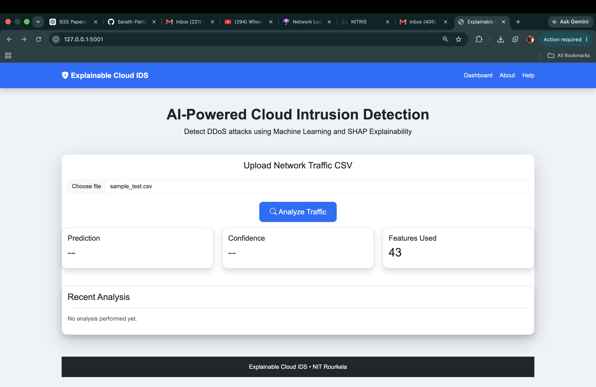
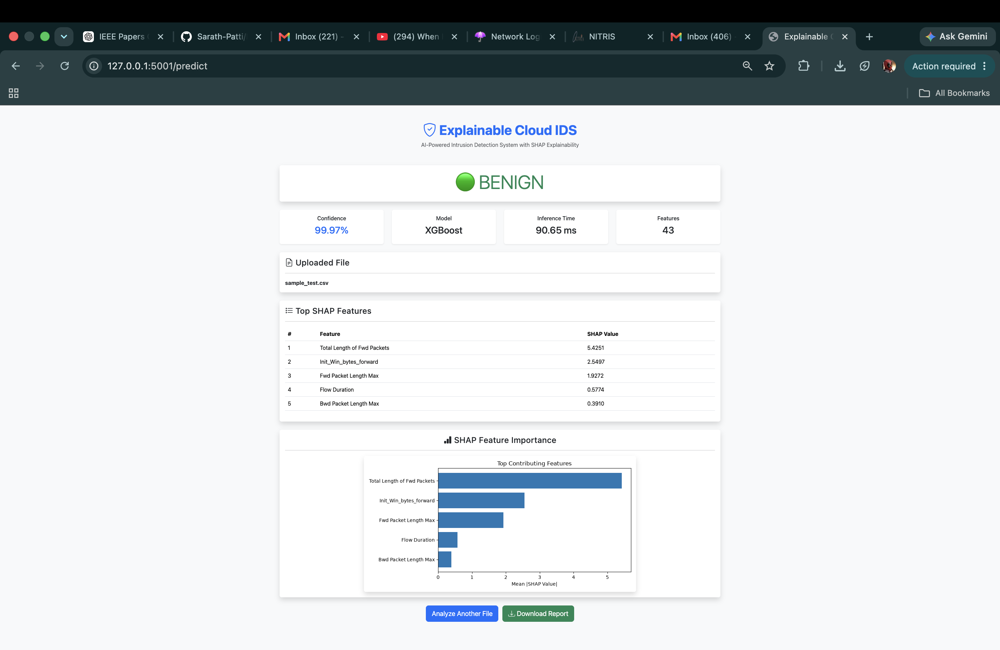
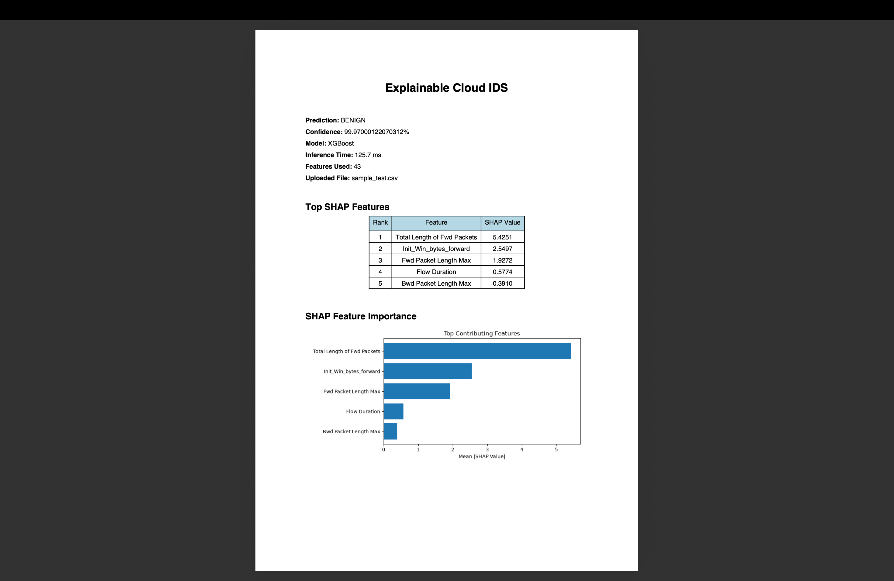
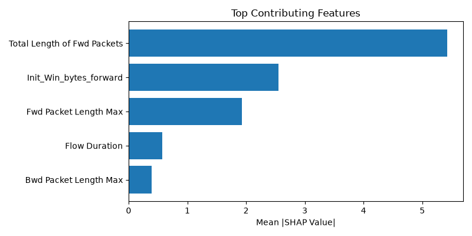

# 🛡️ Explainable Cloud IDS

<p align="center">      </p>

---

## Overview

An AI-powered Cloud Intrusion Detection System that detects DDoS attacks using **XGBoost** and explains every prediction using **SHAP (SHapley Additive Explanations)**.

The project provides an interactive Flask dashboard, confidence estimation, feature importance visualization, and downloadable PDF reports for explainable cybersecurity analysis.

---

## 🚀 Features

- 📂 Upload network traffic CSV files
- 🤖 XGBoost-based intrusion detection
- 📊 SHAP explainability for every prediction
- 📈 Feature importance visualization
- 📉 Confidence score estimation
- ⚡ Fast inference pipeline
- 📄 Downloadable PDF reports
- 🌐 Interactive Flask web interface

---

# 🏗️ System Architecture


The inference workflow is shown below:

```
CSV Upload
     │
     ▼
Data Preprocessing
     │
     ▼
Feature Selection
     │
     ▼
XGBoost Model
     │
     ▼
Prediction + Confidence
     │
     ▼
SHAP Explainability
     │
     ▼
Interactive Dashboard
     │
     ▼
PDF Report Generation
```

---

# 📷 Screenshots

## Home Page



---

## Prediction Dashboard



---

## PDF Report



---

## SHAP Feature Importance



---

# ⚙️ Technology Stack

## Programming Language

- Python 3

## Machine Learning

- XGBoost
- Random Forest
- SHAP
- Scikit-learn

## Data Processing

- Pandas
- NumPy

## Visualization

- Matplotlib

## Web Framework

- Flask
- Bootstrap 5

## Report Generation

- ReportLab

---

# 📁 Project Structure

```
Explainable-Cloud-IDS/

├── app.py
├── requirements.txt
├── README.md

├── data/
│   ├── raw/
│   ├── processed/
│   └── test/

├── docs/
│   ├── architecture.png
│   ├── home.png
│   ├── dashboard.png
│   ├── pdf_report.png
│   └── shap_bar.png

├── models/
│   ├── xgboost_model.pkl
│   ├── random_forest_model.pkl
│   ├── scaler.pkl
│   ├── selected_features.pkl
│   └── label_encoder.pkl

├── reports/

├── src/
│   ├── preprocess.py
│   ├── predictor.py
│   ├── engine.py
│   ├── shap_explainer.py
│   ├── report_generator.py
│   └── create_test_file.py

├── static/
│   ├── css/
│   └── images/

└── templates/
```

---

# 🔬 Methodology

The project follows the pipeline below:

1. Load CICIDS2017 network traffic dataset.
2. Remove invalid values and duplicates.
3. Perform feature scaling.
4. Remove highly correlated features.
5. Train Random Forest and XGBoost models.
6. Compare model performance.
7. Apply SHAP explainability.
8. Select Top-30, Top-20 and Top-10 important features.
9. Deploy the best-performing model using Flask.
10. Generate explainable PDF reports.

---

# 📊 Research Highlights

- Correlation-based feature reduction
- Random Forest baseline model
- XGBoost optimization
- SHAP explainability
- Feature selection using SHAP
- Interactive explainable dashboard
- PDF report generation

---

# 📈 Results

| Component | Status |
|-----------|--------|
| Data Cleaning | ✅ |
| Feature Scaling | ✅ |
| Correlation Analysis | ✅ |
| Random Forest | ✅ |
| XGBoost | ✅ |
| SHAP Explainability | ✅ |
| Feature Selection | ✅ |
| Flask Deployment | ✅ |
| Confidence Score | ✅ |
| PDF Report | ✅ |

---

# ▶️ Installation

```bash
git clone <repository-url>

cd Explainable-Cloud-IDS

python -m venv .venv

source .venv/bin/activate

pip install -r requirements.txt
```

---

# ▶️ Run the Application

```bash
python app.py
```

Open:

```
http://127.0.0.1:5001
```

Upload a CSV file and analyze the prediction.

---

# 📄 Generated Report

The application automatically generates a PDF containing:

- Prediction
- Confidence
- Model Information
- SHAP Feature Ranking
- SHAP Visualization
- Uploaded File Information

---

# 🔮 Future Improvements

- Multi-model selection
- Real-time packet monitoring
- Cloud deployment
- REST API support
- Docker containerization
- Authentication
- Database integration

---

# 👨‍💻 Author

**Sarath Patti**

M.Tech Computer Science

National Institute of Technology Rourkela

---

# 📜 License

This project is intended for educational and research purposes.