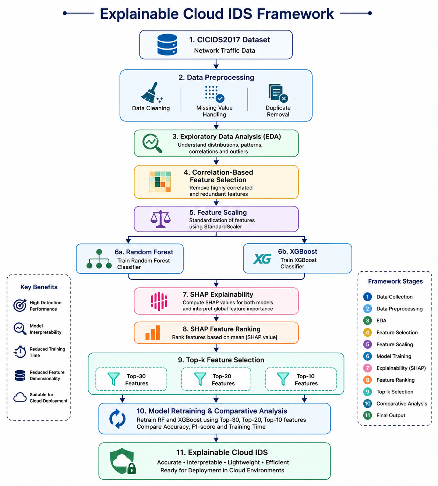

# Explainable Cloud IDS using Machine Learning and SHAP

<p align="center">


</p>

---

## Overview

Explainable Cloud IDS is a machine learning-based Intrusion Detection System (IDS) that detects Distributed Denial-of-Service (DDoS) attacks in cloud environments while providing transparent and interpretable predictions using SHAP (SHapley Additive exPlanations).

Unlike traditional IDS models that operate as black boxes, this framework explains **why** a network flow is classified as malicious and identifies the most influential features responsible for each prediction.

The project also demonstrates that SHAP-based feature selection can significantly reduce the feature space while maintaining nearly identical detection performance, resulting in a lightweight and efficient intrusion detection system.

---

# Framework Architecture

<p align="center">
  
</p>

---

# Objectives

- Detect DDoS attacks using machine learning
- Compare Random Forest and XGBoost classifiers
- Explain model predictions using SHAP
- Reduce redundant features without sacrificing performance
- Build a lightweight and interpretable Cloud IDS

---

# Dataset

**Dataset Used**

- CICIDS2017 Dataset
- Friday Working Hours – Afternoon DDoS

Dataset characteristics

- 223,082 network flows
- Binary classification
- Classes:
  - BENIGN
  - DDoS

---

# Project Workflow

```
CICIDS2017 Dataset
        │
        ▼
Data Cleaning
        │
        ▼
Exploratory Data Analysis
        │
        ▼
Correlation Analysis
        │
        ▼
Feature Selection
        │
        ▼
Feature Scaling
        │
        ▼
Random Forest + XGBoost
        │
        ▼
SHAP Explainability
        │
        ▼
Top-30 / Top-20 / Top-10 Features
        │
        ▼
Model Retraining
        │
        ▼
Experimental Comparison
        │
        ▼
Explainable Cloud IDS
```

---

# Repository Structure

```
Explainable-Cloud-IDS/

│
├── data/
│   ├── raw/
│   └── processed/
│
├── models/
│   ├── random_forest_model.pkl
│   └── xgboost_model.pkl
│
├── reports/
│   ├── project_architecture.png
│   ├── correlation_heatmap.png
│   ├── class_distribution.png
│   ├── feature distributions
│   ├── outlier analysis
│   ├── random forest reports
│   ├── xgboost reports
│   ├── shap summary
│   ├── shap feature importance
│   ├── shap feature ranking
│   ├── comparison_table.csv
│   ├── research_summary.txt
│   └── experiment plots
│
├── src/
│   ├── dataset_loader.py
│   ├── cleaning.py
│   ├── eda.py
│   ├── feature_distribution.py
│   ├── outlier_analysis.py
│   ├── correlation_analysis.py
│   ├── feature_selection.py
│   ├── scaling.py
│   ├── data_split.py
│   ├── random_forest.py
│   ├── xgboost_model.py
│   ├── shap_analysis.py
│   ├── shap_feature_selection.py
│   ├── train_topk.py
│   └── experiment_analysis.py
│
├── notebooks/
├── README.md
└── requirements.txt
```

---

# Machine Learning Models

### Random Forest

- Feature Importance
- Confusion Matrix
- Classification Report
- Performance Metrics

---

### XGBoost

- Gradient Boosted Decision Trees
- High-speed Training
- Feature Importance
- Confusion Matrix
- Classification Report

---

# Explainable AI

SHAP is used to interpret predictions made by XGBoost.

Generated outputs include

- SHAP Summary Plot
- SHAP Feature Importance
- Global Feature Ranking
- Top-30 Features
- Top-20 Features
- Top-10 Features

---

# Experimental Results

| Model | Features | Accuracy | Precision | Recall | F1 Score |
|--------|---------:|---------:|----------:|--------:|---------:|
| Random Forest | 30 | 99.9888% | 99.99% | 99.99% | 99.99% |
| XGBoost | 30 | 99.9978% | 100.00% | 99.996% | 99.998% |
| Random Forest | 20 | 99.9888% | 99.99% | 99.99% | 99.99% |
| XGBoost | 20 | 99.9978% | 100.00% | 99.996% | 99.998% |
| Random Forest | 10 | 99.9910% | 99.99% | 99.996% | 99.992% |
| XGBoost | 10 | 99.9978% | 100.00% | 99.996% | 99.998% |

---

# Key Findings

- Reduced features from **43 to 10** using SHAP ranking.
- Maintained nearly identical detection accuracy after feature reduction.
- XGBoost achieved the highest overall performance.
- Feature reduction significantly decreased Random Forest training time.
- SHAP provided clear explanations for model decisions.

---

# Generated Reports

The project automatically generates

- Correlation Heatmap
- Feature Distribution Plots
- Outlier Analysis
- Random Forest Metrics
- XGBoost Metrics
- Confusion Matrices
- Feature Importance Charts
- SHAP Summary Plot
- SHAP Feature Importance
- SHAP Feature Ranking
- Accuracy Comparison
- F1 Score Comparison
- Training Time Comparison
- Research Summary

---

# Technologies Used

Programming

- Python

Libraries

- Pandas
- NumPy
- Matplotlib
- Scikit-learn
- XGBoost
- SHAP
- Joblib

---

# Future Enhancements

- Web-based Explainable Cloud IDS Dashboard
- Real-time Packet Classification
- Live SHAP Explanations
- REST API
- Docker Deployment
- Kubernetes Deployment
- AWS / Azure / GCP Integration

---

# Research Contribution

This work demonstrates that explainability can be used not only to interpret machine learning predictions but also to identify a compact subset of highly informative network-flow features.

By combining SHAP-based feature ranking with feature reduction and model retraining, the proposed framework achieves high detection accuracy while reducing computational complexity, making it suitable for efficient cloud intrusion detection.

---

# Author

**Sarath Patti**

M.Tech Computer Science  
National Institute of Technology Rourkela

---

## License

This project is intended for academic and research purposes.